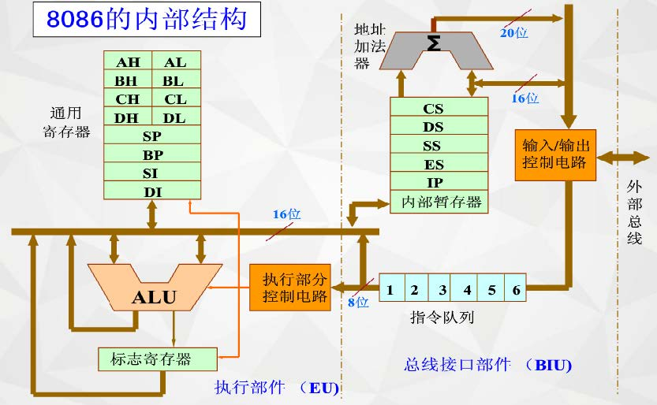
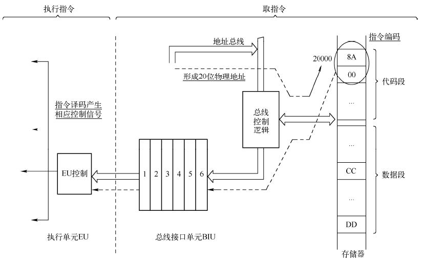

# 微机原理与接口

1. 8086处理器

   1. 微处理器的基本结构

      > 

      * 总线接口单元BIU

        * 8086

          > 16bit数据总线和20bit地址总线，可寻址1M空间

        * 8088

          > 8bit数据总线和20bit地址总线，可寻址1M空间，但内部数据总线仍然是16bit

        > * 组成
        >   * 段寄存器：CS、DS、SS、ES
        >     * 每个段寄存器16位
        >     * 存放相应逻辑段的段基地址
        >     * DS、SS、ES的内容可有程序设置，CS的内容不能用程序设置
        >   * IP指令指针寄存器
        >     * Instruction Pointer，内容为下一条要执行的指令的偏移地址
        >     * IP和CS联合确定下一条要执行的指令的物理地址
        >   * 地址产生器ALU
        >   * 总线控制器
        >   * 指令队列（先入先出FIFO）
        > * 功能
        >   * 执行所有总线操作（取址、取数）
        >   * 通过运算得到20位的物理地址
        >   * 预取指令
        >     * 队列长度：6字节
        >     * 预取方式：闲两个字节就取

      * 执行单元EU

        * 组成
          * 8个通用寄存器（AX、BX、CX、DX、SP、BP、DI、SI）
            * 数据寄存器（4个）：AX、BX、CX、DX
              * AX（Accumulator）：使用频度最高，用于算数、逻辑运算以及与外设传送信息等
              * BX（Base addressRegister）：
            * 地址指针寄存器（2个）：SP、BP
              * 只能以16位参与操作
              * SP（Stack Pointer）：表示堆栈段栈顶的位置（偏移地址）
              * BP（Base Pointer）：表示数据在堆栈段中的地址
            * 变址寄存器（2个）：DI、SI
              * SI（Source Index）
              * DI（Destination Index）
          * 运算器ALU
          * 指令操作控制电路
          * 1个状态标志寄存器
        * 功能（执行指令）
          * 指令译码
          * 指令执行（在ALU中）
          * 暂存中间运算结果（在通用寄存器中）
          * 保存运算结果特征（在标志寄存器FLAGS中）

      * 指令的执行过程

        > 